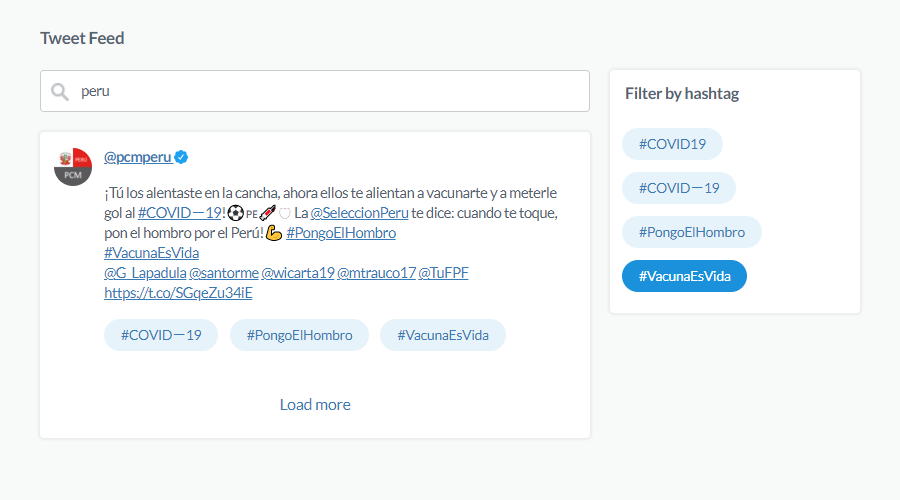

<h2 align="center">Code Challenge: Twitter App</h2>
<h4 align="center">
  Architect designed and developed by <a href="mailto:fajardo.de.leon@gmail.com">Victor Fajardo</a><br />
  [ <a href="https://www.linkedin.com/in/victorfajardo/" target="_blank">linkedin.com/in/victorfajardo</a> | <a href="https://github.com/VictorFajardo" target="_blank">github.com/VictorFajardo</a> | <a href="https://stackshare.io/victorfajardo/software-engineering" target="_blank">stackshare.io/victorfajardo</a> ]
</h4>

---

- [🚀 Demo](#-demo)
- [📡 Proxy Server](#-proxy-server)
- [✨ Development](#-development)
- [📁 File Structure](#-file-structure)
- [⚛️ Redux Toolkit](#%EF%B8%8F-redux-toolkit)
- [💅 CSS-IN-JS: Styled Components](#-css-in-js-styled-components)
- [🐦 Tweet Feed: User Interaction](#-tweet-feed-user-interaction)
- [🗄️ Store Structure](#%EF%B8%8F-store-structure)
- [📑 Documentation Links](#-documentation-links)

This project was bootstrapped with [Create React App](https://github.com/facebook/create-react-app), using the [Redux](https://redux.js.org/) and [Redux Toolkit](https://redux-toolkit.js.org/) template.

---
### 🚀 Demo

Please visit the demo for the fullpage navigation here:\
[https://code-challenge-twitter-app.netlify.app/](https://code-challenge-twitter-app.netlify.app/)

**Desktop View:**
<p align="center">
  
</p>

**Mobile View:**
<p align="center">
  
</p>

### ✨ Development
In the project directory, you can run:

**`yarn proxy`**

Runs the Node/Express proxy server. Open [http://localhost:5000](http://localhost:5000) to view it in the browser.

**`yarn start`**

Runs the app in the development mode. Open [http://localhost:3000](http://localhost:3000) to view it in the browser.

**`yarn test`**

Launches the test runner in the interactive watch mode.<br />

**`yarn build`**

Builds the app for production to the `build` folder. It correctly bundles React in production mode and optimizes the build for the best performance.

### 📡 Proxy Server

The Twitter API does not support CORS. Therefore, the Proxy Server running on port 5000 is the intermediary between the app and the Twitter API.

**Example Call to the Proxy Server**
<p align="center">
  
</p>

> The data returned by the proxy server has been previously transformed according to the project specifications, no data transformations take place on the client side.

### 📁 File Structure

```
📁App                                     
│── package.json
│── README.md
│── tsconfig.json
├── 📁docs                                // contains files for the documentation
├── 📁build
├── 📁public
├── 📁proxy
│   ├── index.js                          // Node/Express proxy server main file
└── 📁src
    ├── index.tsx                         // initialize the app, invokes App.tsx
    ├── react-app-env.d.ts                // create-react app environment file
    ├── setupTests.ts                     // create-react app test config file
    ├── 📁app
    │   ├── App.test.tsx                  // App test cases suite
    │   └── App.tsx                       // App component, includes all the components
    │   ├── 📁components
    │   │   ├── Filter.tsx                // section component, renders hastags to be filtered
    │   │   ├── Header.tsx                // section component, renders title
    │   │   ├── List.tsx                  // section component, renders filtered tweets
    │   │   ├─── Search.tsx               // section component, contains the input field
    │   │   ├─── 📁Hashtags
    │   │   │    ├── BaseHashtag.tsx      // element component: basic hashtag
    │   │   │    └── FilterHashtag.tsx    // element component: filter hashtag
    │   │   └─── 📁Tweets
    │   │        └── Tweet.tsx            // element component: tweet
    ├── 📁common
    │   └── hooks.ts                      // custom hooks: useAppDispatch(), useAppSelector()
    ├── 📁data
    │   ├── api.ts                        // api server information
    │   └── site.ts                       // all the app texts to be rendered information
    ├── 📁features
    │   ├── 📁filter
    │   │   └── filterSlice.test.ts       // filterSlice test cases suite
    │   │   └── filterSlice.ts            // actions and reducer for state.filter
    │   ├── 📁hashtags
    │   │   └── hashtagsSlice.test.ts     // hashtagsSlice test cases suite
    │   │   └── hashtagsSlice.ts          // actions and reducer for state.hashtags
    │   ├── 📁meta
    │   │   └── metaSlice.test.ts         // metaSlice test cases suite
    │   │   └── metaSlice.ts              // actions and reducer for state.meta
    │   ├── 📁query
    │   │   └── querySlice.test.ts        // querySlice test cases suite
    │   │   └── querySlice.ts             // actions and reducer for state.query
    │   └── 📁tweets
    │   │   └── tweetsSlice.test.ts       // tweetsSlice test cases suite
    │       ├── tweetsSlice.ts            // actions and reducer for state.query
    │       └── tweetsApi.ts              // async request for data
    ├── 📁img
    │   └── magnifying-glass.svg          // icon for the Search component
    │   └── verified.svg                  // icon for the Tweet component
    └── 📁store
        └── index.ts                      // app store file
    └── 📁style
        └── GlobalStyle.ts                // global style rules
```
### ⚛️ Redux Toolkit

This app uses **Redux Toolkit** as source of state managment, for more information visit:

- [Redux Toolkit - Tutorials Overview](https://redux-toolkit.js.org/tutorials/overview).

### 💅 CSS-IN-JS: Styled Components

This app uses **Styled Components** to manage the all the style rules. Every component file has its own component style rules, aditionally a global style file can be founded in `/style/GlobalStyle.ts`, for more information visit:

- [Styled Components Documentation](https://styled-components.com/docs)
### 🐦 Tweet Feed: User Interaction

**Fetching Tweets**\
After a query is typed in the `🔍 Search by keyword` input filed (by a debounce functionality) the `updateQuery(query)` action is dispatched to reduce the input query value into `state.query`.\
After `state.query` is updated, the `cleanTweets()`, `cleanHashtags()`, `cleanFilter()` actions are dispatched to clean any previous search, then the `fetchTweets(state.query, max_id = 0)` action is dispatched, this is an async request that create a Promise, after the Promise is solved the returned data is received and processed by 3 reducers to update `state.meta`, `state.hashtags`, and `state.tweets`.

>List.tsx will renders the updated `stage.tweets`.

>Filter.tsx will renders the upload `stage.hashtags`.

**Loading More Tweets**\
After the `Load more tweets` cta is clicked the `fecthTweets(state.query, max_id = state.max_id)` action is dispatched, this is an async request that create a Promise, after the Promise is solved the returned data is received and processed by 3 reducers to update `state.meta`, `state.hashtags`, and `state.tweets`.

>List.tsx will renders the updated `stage.tweets` filtering the result when a hashtag inside the tweet will be equal to an element of the array `state.filter`.

>Filter.tsx will renders the upload `stage.hashtags` withot affect the current `state.filter`.

**Filter By Hashtag**\
After a cta `Hashtag` is clicked the `addFilter(hashtag)` action is dispatched to reduce the hashtag value adding it into the array `state.filter`, is the cta has been already clicked `active = true` the `removeFilter(hashtag)` action is dispatched to reduce the hashtag value removing it from the array `state.hahtags`.

>List.tsx will renders `stage.tweets` filtering the result when a hashtag inside the tweet will be equal to an element of the array `state.filter`.
### 🗄️ Store Structure

```javascript
  {
    filter: {
      value: Array<string>
    },
    hashtags: {
      value: Array<string>
    },
    meta: {
      completed_in: number,
      count: number,
      max_id: string,
      query: string
    },
    query: {
      value: string
    },
    {
      tweets: {
        status: string,
        value: [
          {
            full_text: string,
            hashtags: Array<string>,
            profile_image_url: string,
            screen_name: string,
            urls: [
              {
                display_url: string,
                url: string,
              }
            ],
            user_mentions: Array<string>,
            verified: boolean
          }
        ]
      }
    }
  }
```

### 📑 Documentation Links

- [Create React App documentation](https://facebook.github.io/create-react-app/docs/getting-started).
- [React documentation](https://reactjs.org/).
- [Reac Redux Documentation](https://react-redux.js.org/introduction/getting-started).
